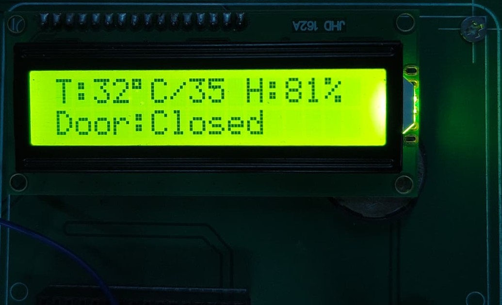

  
  
  
  
  
  

# 🧊 ColdGuard: IoT-Based Cold Storage Monitoring System

  <strong>🌡️ Continuous IoT-enabled monitoring system for cold storage environments</strong> 
  <em>Built on ARM7 (NXP LPC2148) • DHT11 Sensor • ESP-01 Wi-Fi • ThingSpeak Cloud Dashboard</em>

---

## 📖 Project Overview

**ColdGuard** is an embedded systems major project designed to solve a critical real-world problem: **unmonitored temperature and relative humidity excursions in cold storage facilities** can lead to spoilage of perishable goods, pharmaceutical degradation, and significant financial losses.

Built on the **NXP LPC2148 ARM7TDMI-S** microcontroller, ColdGuard provides:

- ✅ **Continuous environmental monitoring** (temperature + relative humidity)
- ✅ **Instant local alerts** via buzzer when thresholds are exceeded
- ✅ **Door-open tracking** with countdown timer and configurable timeout
- ✅ **Cloud-based remote monitoring** via ThingSpeak IoT dashboard
- ✅ **Password-protected configuration** stored in non-volatile EEPROM
- ✅ **Instantaneous LCD feedback** with flicker-free display updates

### 🔧 System Specifications

| Parameter | Specification |
|-----------|---------------|
| **Microcontroller** | NXP LPC2148 — ARM7TDMI-S core, 60 MHz, 512 KB Flash, 32+8 KB SRAM |
| **Temperature Sensor** | DHT11 — Range: 0–50 °C, Accuracy: ±2 °C, Resolution: 1 °C |
| **Relative Humidity Sensor** | DHT11 — Range: 20–90 %RH, Accuracy: ±5 %RH |
| **Display** | 16×2 Character LCD — HD44780 controller, 8-bit parallel interface |
| **Wi-Fi Module** | ESP-01 (ESP8266) — 802.11 b/g/n, UART AT-command interface, 9600 baud |
| **Non-volatile Storage** | AT24C256 — 256 Kbit I2C EEPROM, 64-byte page write |
| **User Input** | 4×4 Matrix Keypad (16 keys) + 2 External Interrupt Push Buttons |
| **Cloud Platform** | ThingSpeak IoT — 4-field channel, 60-second update interval |
| **Alert System** | Active piezo buzzer — threshold, door timeout, and composite alarms |
| **Development IDE** | Keil µVision4 — ARM MDK toolchain |
| **System Clock** | 60 MHz (PLL: 12 MHz × 5), Peripheral clock: 15 MHz (CCLK/4) |

---

## ✨ Features

### Core Monitoring
| Feature | Description |
|---------|-------------|
| 🌡️ **Temperature Monitoring** | DHT11 sensor sampled every 1 second with configurable setpoint (0–50 °C) |
| 💧 **Relative Humidity Monitoring** | Simultaneous relative humidity tracking with configurable setpoint (20–90 %RH) |
| 📟 **Live LCD Dashboard** | Live sensor feed: `T:24°C    RH:58%` — full-width justified, no clear-and-redraw flicker |

### Alert & Safety
| Feature | Description |
|---------|-------------|
| 🔔 **Threshold Alarms** | Buzzer activates immediately when temperature OR relative humidity exceeds setpoint |
| 🚪 **Door Open Detection** | External interrupt (EINT2) detects door state via magnetic reed switch |
| ⏱️ **Door Countdown Timer** | LCD shows live countdown; buzzer sounds if door stays open > 15 seconds |

### IoT & Cloud
| Feature | Description |
|---------|-------------|
| ☁️ **ThingSpeak Upload** | Temperature, relative humidity, door status, and alarm code pushed every 60 seconds |
| 📊 **Remote Dashboard** | View live graphs and historical trends from any browser or phone |
| 🚨 **Door Event Logging** | Two-point door-open/close timestamps enable duration calculation on ThingSpeak |

### Security & Configuration
| Feature | Description |
|---------|-------------|
| 🔒 **Password Protection** | 4-digit PIN required to access configuration menu (max 3 attempts before lockout) |
| 💾 **EEPROM Persistence** | All settings (temp/relative humidity setpoints, password) survive power cycles |
| 🔁 **Fault Tolerance** | DHT11 auto-retries up to 3×; falls back to last known value on persistent failure |

---

## 📸 Project Images

### 1. Full Hardware Board

---

### 2. LCD Display Output

---

### 3. ThingSpeak IoT Dashboard

---

## 🔧 Hardware Components

### Bill of Materials (BOM)

| # | Component | Model / Specification | Interface | Qty |
|:-:|-----------|----------------------|-----------|:---:|
| 1 | **Microcontroller** | NXP LPC2148 (ARM7TDMI-S, 60 MHz, 512 KB Flash, 32+8 KB SRAM) | — | 1 |
| 2 | **Temp & Relative Humidity Sensor** | DHT11 (0–50 °C / 20–90 %RH, single-wire protocol) | GPIO (P0.4) | 1 |
| 3 | **Character LCD** | 16×2 HD44780-compatible (8-bit parallel mode) | 8-bit GPIO | 1 |
| 4 | **Wi-Fi Module** | ESP-01 (ESP8266, 802.11 b/g/n, AT-command firmware) | UART0 @ 9600 | 1 |
| 5 | **EEPROM** | AT24C256 (256 Kbit, I2C, 64-byte page, 400 kHz) | I2C0 | 1 |
| 6 | **Matrix Keypad** | 4×4 membrane keypad (0–9, A–D, *, #) | GPIO (Port 1) | 1 |
| 7 | **Active Buzzer** | 5V piezoelectric buzzer (active, no driver needed) | GPIO (P0.19) | 1 |
| 8 | **Door Sensor** | Magnetic reed switch / tactile push button | EINT2 (P0.7) | 1 |
| 9 | **Menu Button** | Tactile push button (momentary, NO) | EINT3 (P0.20) | 1 |
| 10 | **Crystal Oscillator** | 12 MHz HC49 quartz crystal + 22 pF load capacitors | XTAL1/XTAL2 | 1 |
| 11 | **Voltage Regulators** | LM7805 (5V, 1A) + AMS1117-3.3 (3.3V for ESP-01) | — | 1 each |
| 12 | **Pull-up Resistors** | 4.7 kΩ (DHT11 data line) | — | 1 |
| 13 | **Contrast Pot** | 10 kΩ trimmer potentiometer (LCD VO adjustment) | — | 1 |
| 14 | **Decoupling Caps** | 100 nF ceramic (per IC VCC pin) + 10 µF electrolytic | — | as needed |

---

## ⚡ Circuit Details & Pin Connections

### 🕐 System Clock Configuration

The LPC2148 clock tree is configured in `Startup.s` and `main.c`:

---

### 📍 Pin Mapping — LPC2148

#### Port 0 — Main Peripheral Bus

| Pin | Alternate Function | Signal | Connected To | Direction | Notes |
|:---:|:------------------:|--------|-------------|:---------:|-------|
| P0.0 | TXD0 | UART0 TX | ESP-01 RX | OUT | 3.3V level shift required |
| P0.1 | RXD0 | UART0 RX | ESP-01 TX | IN | 3.3V level shift required |
| P0.2 | SCL0 | I2C0 Clock | AT24C256 SCL | OD | Uses AT24C256 onboard pull-up |
| P0.3 | SDA0 | I2C0 Data | AT24C256 SDA | OD | Uses AT24C256 onboard pull-up |
| P0.4 | — | DHT11 Data | DHT11 DATA | I/O | 4.7 kΩ pull-up, single-wire |
| P0.7 | EINT2 | Door IRQ | Reed Switch → GND | IN | Active-LOW, edge-triggered |
| P0.8–P0.15 | — | LCD D0–D7 | LCD pins 7–14 | OUT | 8-bit data bus |
| P0.16 | — | LCD RS | LCD pin 4 | OUT | 0=Command, 1=Data |
| P0.17 | — | LCD EN | LCD pin 6 | OUT | High-to-low pulse to latch |
| P0.19 | — | Buzzer | Buzzer (+) | OUT | Active-HIGH drive |
| P0.20 | EINT3 | Menu IRQ | Push Button → GND | IN | Active-LOW, edge-triggered |

#### Port 1 — 4×4 Keypad Matrix

| Pin | Function | Direction |
|:---:|----------|:---------:|
| P1.16–P1.19 | Column 0–3 | IN (internal pull-up) |
| P1.20–P1.23 | Row 0–3 | OUT (Active-LOW scan) |

---

## 🗺️ Circuit Block Diagram

### Interrupt Map

| Interrupt | Source | Pin | Trigger | Purpose |
|-----------|--------|-----|---------|---------|
| **EINT2** | Door reed switch | P0.7 | Falling edge (Active-LOW) | Wake main loop for door event |
| **EINT3** | Menu push button | P0.20 | Falling edge (Active-LOW) | Enter configuration menu |
| **Timer0** | Internal | — | Match register | Microsecond/millisecond delay generation |

---

## 🏗️ Software Architecture

The firmware follows a **modular driver architecture** — each peripheral has its own `.c`/`.h` pair with a clean public API:

### Main Loop State Machine

---

## ☁️ ThingSpeak IoT Dashboard

Data is uploaded to **ThingSpeak** via HTTP GET requests through the ESP-01 Wi-Fi module. The free-tier update interval is **60 seconds** (ThingSpeak requires ≥15 s between channel updates).

### Channel Field Mapping

| Field | Data Type | Unit | Range | Description |
|:-----:|-----------|:----:|-------|-------------|
| `field1` | Temperature | °C | 0–50 | DHT11 integer temperature reading |
| `field2` | Relative Humidity | %RH | 20–90 | DHT11 integer relative humidity reading |
| `field3` | Door Status | flag | 0 / 1 | `1` = door-opened event, `0` = door-closed event |
| `field4` | Alarm Code | enum | 0–3 | `0`=OK, `1`=Temp high, `2`=RH high, `3`=Both |

---

## 📟 LCD Display States

The 16×2 LCD shows different screens depending on system state:

---

## ⚙️ System Configuration

All user-adjustable settings are defined in [`config.h`](config.h):

| Macro | Default | Range | Description |
|-------|:-------:|:-----:|-------------|
| `DEFAULT_TEMP_SETPOINT` | 35 °C | 0–50 | Temperature alarm trigger point |
| `DEFAULT_HUMIDITY_SETPOINT` | 65 %RH | 20–90 | Relative humidity alarm trigger point |
| `DOOR_OPEN_ALERT_SECONDS` | 15 s | — | Door open duration before alarm |
| `SENSOR_SAMPLE_DELAY_MS` | 1000 ms | ≥1000 | DHT11 sample interval (min 1 s per datasheet) |
| `DEFAULT_PASSWORD` | `"1234"` | — | Factory-default 4-digit PIN |
| `MAX_PASSWORD_ATTEMPTS` | 3 | — | Wrong entries before lockout |
| `ESP_ENABLE` | 1 | 0/1 | Set to `0` to disable all Wi-Fi features |
| `EEPROM_FIRST_TIME_SETUP` | 0 | 0/1 | Set to `1` once for factory reset, then back to `0` |

---

## 🔒 Menu & Password System

The configuration menu is hardware-gated behind an external interrupt (EINT3) and software-gated behind a 4-digit PIN:

### Menu Options

| Option | Input Range | Stored In |
|--------|:-----------:|-----------|
| Temperature Setpoint | 0 – 50 °C | EEPROM + RAM |
| Relative Humidity Setpoint | 20 – 90 %RH | EEPROM + RAM |
| Change Password | 4 digits | EEPROM + RAM |

---

## 👨‍💻 Author

**Mihir** — ARM Embedded Systems Major Project

| | |
|---|---|
| **Platform** | NXP LPC2148 (ARM7TDMI-S) |
| **IDE** | Keil µVision4 |
| **Cloud** | ThingSpeak IoT Platform |
| **Language** | Embedded C (ANSI C89) |

---

## 📄 License

This project is developed for **academic purposes** as part of a Major Project in ARM Embedded Systems.

---

  <strong>Built with ❤️ on ARM7 — ColdGuard keeps the cold in check.</strong>

