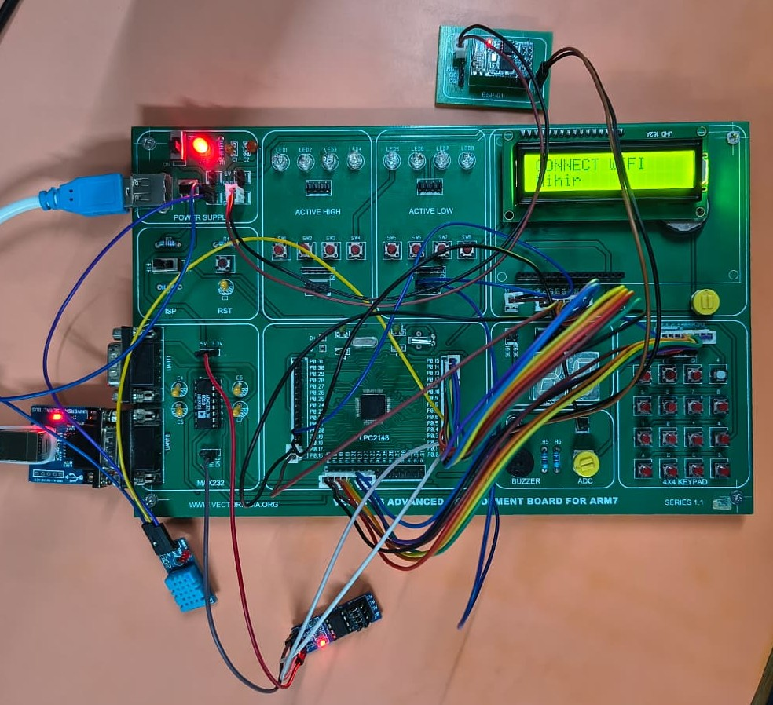
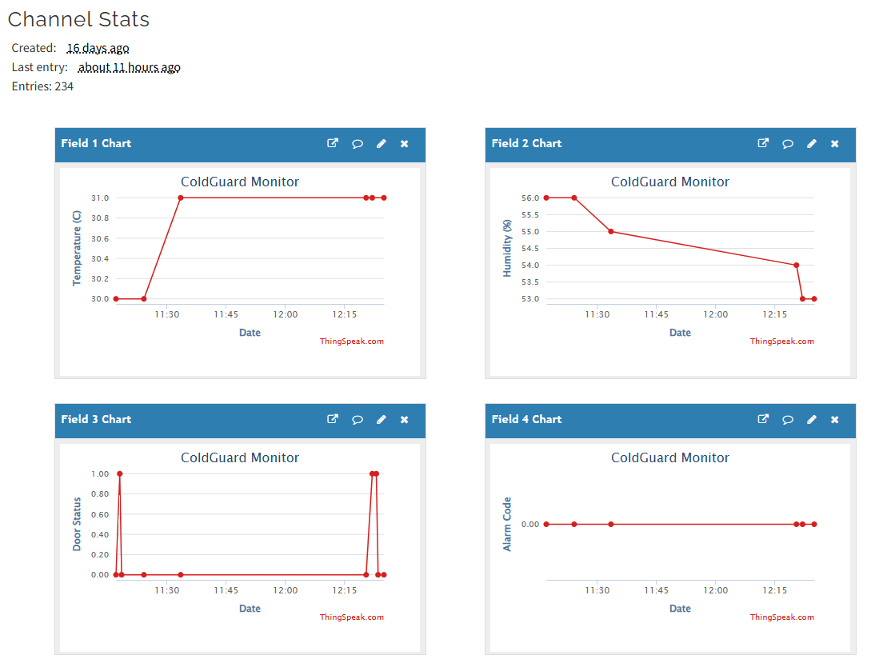

<p align="center">
  
  
  
  
  
  
</p>

# 🧊 ColdGuard: IoT-Based Cold Storage Monitoring System

<p align="center">
  <strong>🌡️ Continuous IoT-enabled monitoring system for cold storage environments</strong><br/>
  <em>Built on ARM7 (NXP LPC2148) • DHT11 Sensor • ESP-01 Wi-Fi • ThingSpeak Cloud Dashboard</em>
</p>

---

## 📌 Table of Contents

| # | Section | Description |
|---|---------|-------------|
| 1 | [Project Overview](#-project-overview) | What ColdGuard does and why |
| 2 | [Features](#-features) | Complete feature list |
| 3 | [Project Images](#-project-images) | Hardware board, display & ThingSpeak dashboard photos |
| 4 | [Hardware Components](#-hardware-components) | Full Bill of Materials |
| 5 | [Circuit Details & Pin Connections](#-circuit-details--pin-connections) | Pinout, clock, wiring diagrams |
| 6 | [Circuit Block Diagram](#-circuit-block-diagram) | Visual system architecture |
| 7 | [Software Architecture](#-software-architecture) | Code structure & main loop flow |
| 8 | [ThingSpeak IoT Dashboard](#-thingspeak-iot-dashboard) | Cloud data fields & protocol |
| 9 | [LCD Display States](#-lcd-display-states) | All display screen layouts |
| 10 | [System Configuration](#-system-configuration) | Configurable parameters |
| 11 | [Menu & Password System](#-menu--password-system) | Secure settings access |
| 12 | [Build & Flash Instructions](#-build--flash-instructions) | How to compile and deploy |
| 13 | [File Structure](#-file-structure) | Source code organization |

---

## 📖 Project Overview

**ColdGuard** is an embedded systems major project designed to solve a critical real-world problem: **unmonitored temperature and humidity excursions in cold storage facilities** can lead to spoilage of perishable goods, pharmaceutical degradation, and significant financial losses.

Built on the **NXP LPC2148 ARM7TDMI-S** microcontroller, ColdGuard provides:

- ✅ **Continuous environmental monitoring** (temperature + humidity)
- ✅ **Instant local alerts** via buzzer when thresholds are exceeded
- ✅ **Door-open tracking** with countdown timer and configurable timeout
- ✅ **Cloud-based remote monitoring** via ThingSpeak IoT dashboard
- ✅ **Password-protected configuration** stored in non-volatile EEPROM
- ✅ **Instantaneous LCD feedback** with flicker-free display updates

### 🔧 System Specifications

| Parameter | Specification |
|-----------|---------------|
| **Microcontroller** | NXP LPC2148 — ARM7TDMI-S core, 60 MHz, 512 KB Flash, 32+8 KB SRAM |
| **Temperature Sensor** | DHT11 — Range: 0–50 °C, Accuracy: ±2 °C, Resolution: 1 °C |
| **Humidity Sensor** | DHT11 — Range: 20–90 %RH, Accuracy: ±5 %RH |
| **Display** | 16×2 Character LCD — HD44780 controller, 8-bit parallel interface |
| **Wi-Fi Module** | ESP-01 (ESP8266) — 802.11 b/g/n, UART AT-command interface, 9600 baud |
| **Non-volatile Storage** | AT24C256 — 256 Kbit I2C EEPROM, 64-byte page write |
| **User Input** | 4×4 Matrix Keypad (16 keys) + 2 External Interrupt Push Buttons |
| **Cloud Platform** | ThingSpeak IoT — 4-field channel, 60-second update interval |
| **Alert System** | Active piezo buzzer — threshold, door timeout, and composite alarms |
| **Development IDE** | Keil µVision4 — ARM MDK toolchain |
| **System Clock** | 60 MHz (PLL: 12 MHz × 5), Peripheral clock: 15 MHz (CCLK/4) |

---

## ✨ Features

### Core Monitoring
| Feature | Description |
|---------|-------------|
| 🌡️ **Temperature Monitoring** | DHT11 sensor sampled every 1 second with configurable setpoint (0–50 °C) |
| 💧 **Humidity Monitoring** | Simultaneous humidity tracking with configurable setpoint (20–90 %RH) |
| 📟 **Live LCD Dashboard** | Live sensor feed: `T:24°C    RH:58%` — full-width justified, no clear-and-redraw flicker |

### Alert & Safety
| Feature | Description |
|---------|-------------|
| 🔔 **Threshold Alarms** | Buzzer activates immediately when temperature OR humidity exceeds setpoint |
| 🚪 **Door Open Detection** | External interrupt (EINT2) detects door state via magnetic reed switch |
| ⏱️ **Door Countdown Timer** | LCD shows live countdown; buzzer sounds if door stays open > 15 seconds |

### IoT & Cloud
| Feature | Description |
|---------|-------------|
| ☁️ **ThingSpeak Upload** | Temperature, humidity, door status, and alarm code pushed every 60 seconds |
| 📊 **Remote Dashboard** | View live graphs and historical trends from any browser or phone |
| 🚨 **Door Event Logging** | Two-point door-open/close timestamps enable duration calculation on ThingSpeak |

### Security & Configuration
| Feature | Description |
|---------|-------------|
| 🔒 **Password Protection** | 4-digit PIN required to access configuration menu (max 3 attempts before lockout) |
| 💾 **EEPROM Persistence** | All settings (temp/humidity setpoints, password) survive power cycles |
| 🔁 **Fault Tolerance** | DHT11 auto-retries up to 3×; falls back to last known value on persistent failure |

---

## 📸 Project Images

### 1. Full Hardware Board

> *Complete ColdGuard hardware assembly showing the LPC2148 development board with all peripheral modules connected — DHT11 sensor, ESP-01 Wi-Fi module, 16×2 LCD, 4×4 keypad, buzzer, door switch, and EEPROM.*



---

### 2. LCD Display Output

> *ColdGuard running in monitoring mode — LCD shows live temperature, humidity, setpoint values, and door status.*


---

### 3. ThingSpeak IoT Dashboard

> *Live ThingSpeak channel showing continuous graphs for temperature (field1), humidity (field2), door status (field3), and alarm code (field4) — data uploaded every 60 seconds via the ESP-01 Wi-Fi module.*



---

## 🔧 Hardware Components

### Bill of Materials (BOM)

| # | Component | Model / Specification | Interface | Qty |
|:-:|-----------|----------------------|-----------|:---:|
| 1 | **Microcontroller** | NXP LPC2148 (ARM7TDMI-S, 60 MHz, 512 KB Flash, 32+8 KB SRAM) | — | 1 |
| 2 | **Temp & Humidity Sensor** | DHT11 (0–50 °C / 20–90 %RH, single-wire protocol) | GPIO (P0.4) | 1 |
| 3 | **Character LCD** | 16×2 HD44780-compatible (8-bit parallel mode) | 8-bit GPIO | 1 |
| 4 | **Wi-Fi Module** | ESP-01 (ESP8266, 802.11 b/g/n, AT-command firmware) | UART0 @ 9600 | 1 |
| 5 | **EEPROM** | AT24C256 (256 Kbit, I2C, 64-byte page, 400 kHz) | I2C0 | 1 |
| 6 | **Matrix Keypad** | 4×4 membrane keypad (0–9, A–D, *, #) | GPIO (Port 1) | 1 |
| 7 | **Active Buzzer** | 5V piezoelectric buzzer (active, no driver needed) | GPIO (P0.19) | 1 |
| 8 | **Door Sensor** | Magnetic reed switch / tactile push button | EINT2 (P0.7) | 1 |
| 9 | **Menu Button** | Tactile push button (momentary, NO) | EINT3 (P0.20) | 1 |
| 10 | **Crystal Oscillator** | 12 MHz HC49 quartz crystal + 22 pF load capacitors | XTAL1/XTAL2 | 1 |
| 11 | **Voltage Regulators** | LM7805 (5V, 1A) + AMS1117-3.3 (3.3V for ESP-01) | — | 1 each |
| 12 | **Pull-up Resistors** | 4.7 kΩ (DHT11 data line) | — | 1 |
| 13 | **Contrast Pot** | 10 kΩ trimmer potentiometer (LCD VO adjustment) | — | 1 |
| 14 | **Decoupling Caps** | 100 nF ceramic (per IC VCC pin) + 10 µF electrolytic | — | as needed |

---

## ⚡ Circuit Details & Pin Connections

### 🕐 System Clock Configuration

The LPC2148 clock tree is configured in `Startup.s` and `main.c`:


---

### 📍 Complete Pin Mapping — LPC2148

#### Port 0 — Main Peripheral Bus

| Pin | Alternate Function | Signal | Connected To | Direction | Notes |
|:---:|:------------------:|--------|-------------|:---------:|-------|
| P0.0 | TXD0 | UART0 TX | ESP-01 RX | OUT | 3.3V level shift required |
| P0.1 | RXD0 | UART0 RX | ESP-01 TX | IN | 3.3V level shift required |
| P0.2 | SCL0 | I2C0 Clock | AT24C256 SCL | OD | Uses AT24C256 onboard pull-up |
| P0.3 | SDA0 | I2C0 Data | AT24C256 SDA | OD | Uses AT24C256 onboard pull-up |
| P0.4 | — | DHT11 Data | DHT11 DATA | I/O | 4.7 kΩ pull-up, single-wire |
| P0.7 | EINT2 | Door IRQ | Reed Switch → GND | IN | Active-LOW, edge-triggered |
| P0.8 | — | LCD D0 | LCD pin 7 | OUT | 8-bit data bus (LSB) |
| P0.9 | — | LCD D1 | LCD pin 8 | OUT | |
| P0.10 | — | LCD D2 | LCD pin 9 | OUT | |
| P0.11 | — | LCD D3 | LCD pin 10 | OUT | |
| P0.12 | — | LCD D4 | LCD pin 11 | OUT | |
| P0.13 | — | LCD D5 | LCD pin 12 | OUT | |
| P0.14 | — | LCD D6 | LCD pin 13 | OUT | |
| P0.15 | — | LCD D7 | LCD pin 14 | OUT | 8-bit data bus (MSB) |
| P0.16 | — | LCD RS | LCD pin 4 | OUT | 0=Command, 1=Data |
| P0.17 | — | LCD EN | LCD pin 6 | OUT | High-to-low pulse to latch |
| P0.19 | — | Buzzer | Buzzer (+) | OUT | Active-HIGH drive |
| P0.20 | EINT3 | Menu IRQ | Push Button → GND | IN | Active-LOW, edge-triggered |

#### Port 1 — 4×4 Keypad Matrix

| Pin | Function | Direction | Notes |
|:---:|----------|:---------:|-------|
| P1.16 | Column 0 | IN | Internal pull-up enabled |
| P1.17 | Column 1 | IN | Internal pull-up enabled |
| P1.18 | Column 2 | IN | Internal pull-up enabled |
| P1.19 | Column 3 | IN | Internal pull-up enabled |
| P1.20 | Row 0 | OUT | Active-LOW scan |
| P1.21 | Row 1 | OUT | Active-LOW scan |
| P1.22 | Row 2 | OUT | Active-LOW scan |
| P1.23 | Row 3 | OUT | Active-LOW scan |

---

## 🗺️ Circuit Block Diagram

> **Complete system interconnection diagram showing all modules, communication buses, and data flow.**


### Data Flow Summary


### Interrupt Map

| Interrupt | Source | Pin | Trigger | Purpose |
|-----------|--------|-----|---------|---------|
| **EINT2** | Door reed switch | P0.7 | Falling edge (Active-LOW) | Wake main loop for door event |
| **EINT3** | Menu push button | P0.20 | Falling edge (Active-LOW) | Enter configuration menu |
| **Timer0** | Internal | — | Match register | Microsecond/millisecond delay generation |

---

## 🏗️ Software Architecture

The firmware follows a **modular driver architecture** — each peripheral has its own `.c`/`.h` pair with a clean public API:


### Main Loop State Machine


---

## ☁️ ThingSpeak IoT Dashboard

Data is uploaded to **ThingSpeak** via HTTP GET requests through the ESP-01 Wi-Fi module. The free-tier update interval is **60 seconds** (ThingSpeak requires ≥15 s between channel updates).

### Channel Field Mapping

| Field | Data Type | Unit | Range | Description |
|:-----:|-----------|:----:|-------|-------------|
| `field1` | Temperature | °C | 0–50 | DHT11 integer temperature reading |
| `field2` | Humidity | %RH | 20–90 | DHT11 integer relative humidity reading |
| `field3` | Door Status | flag | 0 / 1 | `1` = door-opened event, `0` = door-closed event |
| `field4` | Alarm Code | enum | 0–3 | `0`=OK, `1`=Temp high, `2`=Humidity high, `3`=Both |

### HTTP Request Format

```
GET /update?api_key=<WRITE_KEY>&field1=<temp>&field2=<humidity>&field3=<door>&field4=<alarm>
Host: api.thingspeak.com
```

### Door Event Protocol (Dual-Timestamp)

When the door is held open **longer than 15 seconds**, ColdGuard sends **two sequential updates** to enable open-duration calculation on ThingSpeak:


---

## 📟 LCD Display States

The 16×2 LCD shows different screens depending on system state:


---

## ⚙️ System Configuration

All user-adjustable settings are defined in [`config.h`](config.h):

### Sensor & Alarm Thresholds

| Macro | Default | Range | Description |
|-------|:-------:|:-----:|-------------|
| `DEFAULT_TEMP_SETPOINT` | 35 °C | 0–50 | Temperature alarm trigger point |
| `DEFAULT_HUMIDITY_SETPOINT` | 65 %RH | 20–90 | Humidity alarm trigger point |
| `DOOR_OPEN_ALERT_SECONDS` | 15 s | — | Door open duration before alarm |
| `SENSOR_SAMPLE_DELAY_MS` | 1000 ms | ≥1000 | DHT11 sample interval (min 1s per datasheet) |

### Security

| Macro | Default | Description |
|-------|:-------:|-------------|
| `DEFAULT_PASSWORD` | `"1234"` | Factory-default 4-digit PIN |
| `PASSWORD_MIN_LEN` | 4 | Minimum allowed PIN length |
| `PASSWORD_MAX_LEN` | 4 | Maximum allowed PIN length |
| `MAX_PASSWORD_ATTEMPTS` | 3 | Wrong entries before lockout |

### Wi-Fi & ThingSpeak

| Macro | Default | Description |
|-------|---------|-------------|
| `ESP_ENABLE` | 1 | Set to `0` to disable all Wi-Fi features |
| `WIFI_SSID` | `"Mihir"` | Your Wi-Fi network name |
| `WIFI_PASSWORD` | `"********"` | Your Wi-Fi password |
| `THINGSPEAK_WRITE_API_KEY` | `"YOUR_KEY"` | ThingSpeak channel write API key |
| `THINGSPEAK_HOST` | `"api.thingspeak.com"` | ThingSpeak API endpoint |
| `THINGSPEAK_PORT` | 80 | HTTP port |

### EEPROM

| Macro | Default | Description |
|-------|:-------:|-------------|
| `EEPROM_FIRST_TIME_SETUP` | 0 | Set to `1` **once** for factory reset, then set back to `0` |

> ⚠️ **Security Warning:** Before pushing to GitHub, move `WIFI_SSID`, `WIFI_PASSWORD`, and `THINGSPEAK_WRITE_API_KEY` to a separate `secrets.h` file and add it to `.gitignore`.

---

## 🔒 Menu & Password System

The configuration menu is hardware-gated behind an external interrupt and software-gated behind a PIN:


### Menu Options

| Option | Input Range | Stored In | Notes |
|--------|:-----------:|-----------|-------|
| Temperature Setpoint | 0 – 50 °C | EEPROM + RAM | Immediate effect on alarm logic |
| Humidity Setpoint | 20 – 90 %RH | EEPROM + RAM | Immediate effect on alarm logic |
| Change Password | 4 digits | EEPROM + RAM | New PIN required on next menu access |

---

## 🛠️ Build & Flash Instructions

### Prerequisites

| Tool | Version | Purpose |
|------|---------|---------|
| **Keil µVision** | v4 or v5 (legacy pack) | IDE + ARM MDK compiler |
| **LPC2148 Device Pack** | — | CMSIS headers + startup files |
| **Flash Magic** | v14+ | ISP flash programming via UART |
| *or* **Keil ULINK** | — | JTAG/SWD flash programming |

### Step-by-Step Build & Deploy

```
Step 1: Clone Repository
────────────────────────
    $ git clone https://github.com/<your-username>/coldguard.git
    $ cd coldguard

Step 2: Configure Wi-Fi Credentials
────────────────────────────────────
    Open config.h and edit:
    #define WIFI_SSID            "YourNetworkName"
    #define WIFI_PASSWORD        "YourPassword"
    #define THINGSPEAK_WRITE_API_KEY  "YourAPIKey"

Step 3: Open in Keil µVision
────────────────────────────
    File → Open Project → major.uvproj

Step 4: Build
─────────────
    Press F7 or Project → Build Target
    Output: major.hex (in project root)
    Expected: "0 Error(s), 0 Warning(s)"

Step 5: Flash via ISP
─────────────────────
    Open Flash Magic:
      Device     : LPC2148
      COM Port   : COMx @ 9600 baud
      Oscillator : 12 MHz
      Hex File   : major.hex
    → Click "Start" to program

Step 6: First-Time EEPROM Setup (one-time only)
───────────────────────────────────────────────
    1. In config.h: set EEPROM_FIRST_TIME_SETUP to 1
    2. Rebuild + Flash → writes factory defaults to EEPROM
    3. IMMEDIATELY set EEPROM_FIRST_TIME_SETUP back to 0
    4. Rebuild + Flash again for normal operation
```

---

## 📁 File Structure

```
coldguard/
│
├── 📄 README.md                 ← This file
│
├── 🖼️ images/                   ← Project photos & diagrams
│   ├── hardware_board.jpeg             ← Full hardware assembly
│   ├── display.jpeg                    ← LCD display output
│   ├── thingspeak_dashboard.png        ← ThingSpeak channel UI
│   ├── system_clock_configuration.png  ← PLL & clock tree block
│   ├── circuit_block_diagram.png       ← Interconnection map
│   ├── data_flow_summary.png           ← Data movement flow
│   ├── software_architecture.png       ← Firmware layer diagram
│   ├── main_loop_state_machine.png     ← Core execution loop
│   ├── door_event_protocol.png         ← Event timing protocol
│   ├── lcd_display_states.png          ← Screen layout maps
│   └── menu_password_system.png        ← Security & config flowchart
│
├── ⚙️ Core Application
│   ├── main.c                   ← Entry point, Init_All(), main loop
│   ├── config.h                 ← All pin definitions, clocks, thresholds, credentials
│   ├── app_config.h             ← SystemConfig struct (setpoints + password)
│   ├── defines.h                ← Bit-manipulation macros (SETBIT, CLRBIT, etc.)
│   └── types.h                  ← Portable type aliases: u8, u16, u32, s16
│
├── 🌡️ Sensor Drivers
│   ├── dht11.c / dht11.h       ← DHT11 single-wire temperature & humidity
│   └── door_interrupt.c / .h   ← EINT2 ISR, Door_IsOpen() status
│
├── 📟 Display
│   └── lcd.c / lcd.h           ← HD44780 8-bit driver, goto, print, clear
│
├── 📡 Communication
│   ├── uart0.c / uart0.h       ← UART0 driver (9600 baud)
│   ├── esp01.c / esp01.h       ← ESP-01 AT commands + ThingSpeak HTTP upload
│   ├── i2c.c / i2c.h           ← I2C0 hardware driver
│   └── eeprom.c / eeprom.h     ← AT24C256 EEPROM config load/save
│
├── ⌨️ User Input
│   ├── keypad.c / keypad.h     ← 4×4 matrix scan + debounce
│   ├── password.c / password.h ← PIN entry & verification
│   └── menu.c / menu.h         ← Interactive configuration menu
│
├── 🔔 Output
│   └── buzzer.c / buzzer.h     ← Buzzer on/off control
│
├── 🔧 Utilities
│   ├── delay.c / delay.h       ← Timer0-based microsecond/millisecond delays
│   ├── logger.c / logger.h     ← UART debug print
│   └── rtc.c / rtc.h           ← Real-time clock utilities
│
├── 🏗️ Build System
│   ├── Startup.s               ← ARM7 startup assembly (PLL, MAM, stacks)
│   ├── major.uvproj            ← Keil µVision project file
│   ├── major.sct               ← Linker scatter file (memory layout)
│   └── major.hex               ← Compiled firmware (ready to flash)
│
└── 📋 Build Artifacts (generated)
    ├── *.o                      ← Object files
    ├── *.crf                    ← Cross-reference files
    ├── *.d                      ← Dependency files
    ├── major.axf                ← ELF executable
    └── major.map                ← Linker memory map
```

---

## 👨‍💻 Author

**Mihir** — ARM Embedded Systems Major Project

| | |
|---|---|
| **Project** | ColdGuard — IoT Cold Storage Monitor |
| **Platform** | NXP LPC2148 (ARM7TDMI-S) |
| **IDE** | Keil µVision4 |
| **Cloud** | ThingSpeak IoT Platform |
| **Language** | Embedded C (ANSI C89) |

---

## 📄 License

This project is developed for **academic purposes** as part of a Major Project in ARM Embedded Systems.

---

<p align="center">
  <strong>Built with ❤️ on ARM7 — ColdGuard keeps the cold in check.</strong>
</p>
